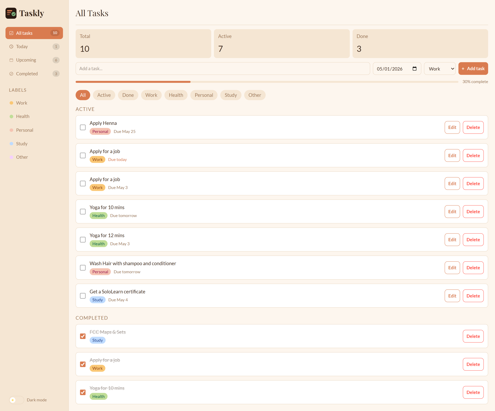

# 📝 Taskly — Done Feels Good

A clean and minimal fast task management app built with React. Organize tasks by label, track what's due today, and stay on top of upcoming deadlines — all saved locally in your browser.

---

## 🔗 Links

- **Live Demo:** [https://taskly-done-feels-good.netlify.app/](https://taskly-done-feels-good.netlify.app/)
- **Repository:** [https://github.com/MahmudaJahan99/Taskly---Done-Feels-Good](https://github.com/MahmudaJahan99/Taskly---Done-Feels-Good)

---

## Features

- **Add, edit, and delete tasks** with a title, due date, and label
- **Undo delete** — a 5-second window to recover a deleted task
- **Label-based organization** — Work, Health, Personal, Study, Other — each with its own page
- **Smart due date indicators** — shows "Due today", "Due tomorrow", "3d overdue", etc.
- **Filter pills** on every page to quickly switch between All, Active, and Done tasks
- **Dark mode** — persisted across sessions
- **Toast notifications** — contextual feedback for every action
- **Animated task list** — smooth enter/exit transitions
- **Today view** — tasks due today that aren't completed yet
- **Upcoming view** — future tasks sorted by what's coming next
- **Completed view** — a dedicated archive of everything you've finished
- **Progress bar** — visual completion percentage on every page
- **Global stat cards** on the All Tasks page that stay pinned regardless of active filter
- **Persistent storage** — tasks are saved to `localStorage` and survive page refreshes

---

## Tech Stack

| Tool | Purpose |
|---|---|
| React 19 | UI |
| React Router v7 | Routing |
| Zustand | Global state + localStorage persistence |
| Animations | Motion (Framer Motion) |
| Tailwind CSS v4 | Styling |
| Build tool | Vite |
| React Icons | Icons |
| Vite | Build tool |

---

## 👩‍💻 Author

Mahmuda Jahan. Built as Project of a React 19 learning journey.

---

## License

MIT